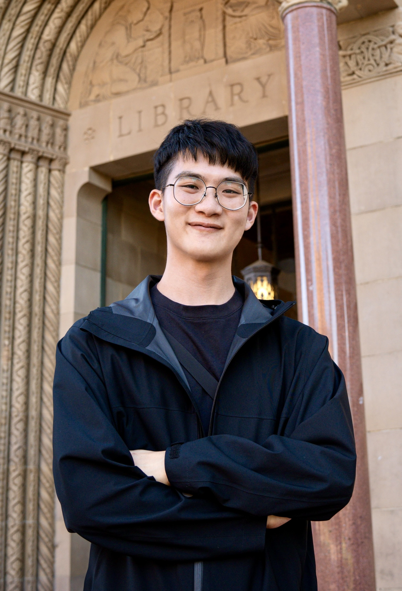

**Takun Wang**  
Ph.D. Student, Sociology & Social Policy  
Princeton University

Email:

*takun.wang@princeton.edu*

Links:

[*Curriculum Vitae*](https://drive.google.com/file/d/1YKjheNhJ9ViEE0HNoPQ6EqBIXrAWeoRr/view?usp=sharing)

[*Princeton Sociology*](https://sociology.princeton.edu/people/takun-wang)

[*GitHub*](https://github.com/wangtakun)

# Biography

Welcome! My name is Takun (rhymes with "tycoon") and I am a Ph.D. student in Sociology and Social Policy at Princeton University.

I study **how education systems allocate opportunity — and to what extent schooling can alleviate, rather than reproduce, social inequality**. My current research centers on the **transition from high school to college**: how students move into higher education and how opportunities for it are allocated. Within this transition, college admissions is the central allocation moment, with students on the demand side and institutions on the supply side — together shaping both who gains access and what counts as "merit."

This agenda grows out of a broader interest in three aspects of educational inequality, which I study primarily with quantitative and causal inference methods:

* **Access to education**, examined in my paper under review on parental school choice.

* **The effects of schooling**, analyzed in a working paper on the heterogeneous impacts of schooling on cognitive and noncognitive skills.

* **The processes within schools**, the subject of my published papers on curriculum development and AI in educational practice.

 

I graduated with a B.A. in sociology from National Taiwan University and worked as a secondary school teacher and administrator in rural Taiwan for three years — an experience that keeps my research anchored in questions of educational equity. Before Princeton, I received an M.A. in education from National Taiwan Normal University, where I earned a scholarship to visit UC Berkeley for an academic year.

I'm happy to hear from you!

 
 
 

# Research

<h4> Working Paper </h4>

* **Wang, Takun**. "Does Schooling Promote Cognitive and Non-cognitive Skills? Evidence from a Regression Discontinuity Design."

 

<h4> Paper Under Review </h4>

* **Wang, Takun**. "School Distinction: How Social Class Shapes Parental School Choice." (R&R)

 

<h4> Published Papers </h4>

* **Wang, Takun**. 2025. "Institutionalizing 'Experimental Education': The Tension Between Alternative Education and State-Led Educational Experiments." *Bulletin of Education Research* 71(3): 123–167. [DOI](https://doi.org/10.6910/BER.202509_71%283%29.0002)

* Fan, Hsin-Hsien and **Takun Wang**. 2025. "Exploring the Future Directions of Taiwan's Curriculum Development From the Perspective of International Educational Trends." *Journal of Education Research 371*: 118–32. [DOI](https://doi.org/10.53106/168063602025030371007)

* Lu, Ray and **Takun Wang**. 2023. "Crisis or Opportunity? The Disruption and Innovation of Artificial Intelligence in School Education—Starting with ChatGPT." *Journal of Education Research 355*: 4–15. [DOI](https://doi.org/10.53106/168063602023110355001)

